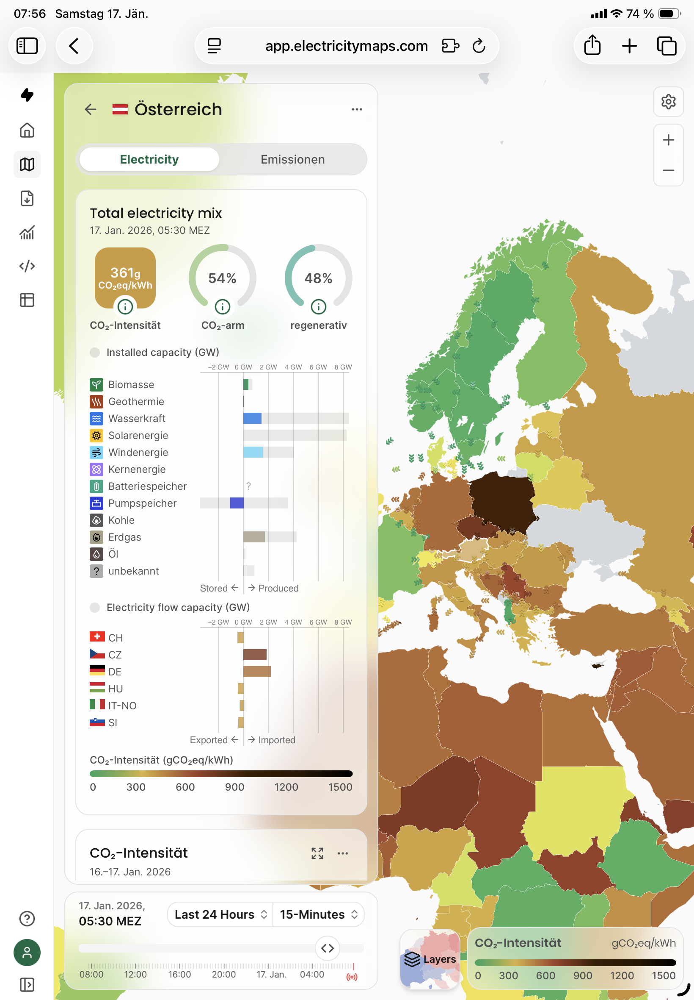

Morgens beim Frühstückskaffee öffne ich gerne [Electricity Maps](https://app.electricitymaps.com)  und schaue mir an, was gerade im europäischen Stromnetz los ist - und wo wir aktuell auf unserem Weg zur vielzitierten grünen Energiewende stehen.

## So auch an diesem Jännerwochenende ...

Größte einzelne Stromquellen in Österreich am Morgen des 17. Jänner 2026: 

1. 🏭🔥💨 Kohle-, Gas und etwas Windstrom aus DE
2. 🏭⚛️ Kohle- und Atomstrom aus CZ
3. 🔥 Gaskraft Ö
4. 💨 Windkraft Ö
5. 💧Wasserkraft Ö

Gleichzeitig speichern wir ein Gigawatt bei 322 CO2/kWh in die Pumpspeicherseen ein, um den Strom danach wieder als Wasserkraft zu verkaufen.

Natürlich sind die kalten dunklen Winterwochen eine extreme Situation. Der herausgestellte Morgen ist ein plakatives Beispiel, aber kein untypisches für die Jahreszeit und Wetterlage.

Ich finde, diese Zahlen sollten uns vor Augen halten, dass wir in Österreich aufhören müssen, uns die Wasserkraft und die grüne Energie schönzureden. Die Realität ist eine starke Abhängigkeit sowohl von fossilen Energieträgern als auch von Importen aus dem Ausland.

Wir müssen massiv in eine grüne Energiewende investieren. Das heißt, in erneuerbare Erzeugung und Übertragung von Strom. Um das zu erreichen müssen wir über unseren eigenen Schatten springen und Kompromisse eingehen. Das alte Denken „wir sind eh schon so gut“ und „ja, aber nicht vor meiner Haustüre“ muss der Vergangenheit angehören, um unseren ehrlichen Beitrag zum Klimaschutz zu leisten und unsere Souveränität zu stärken.

