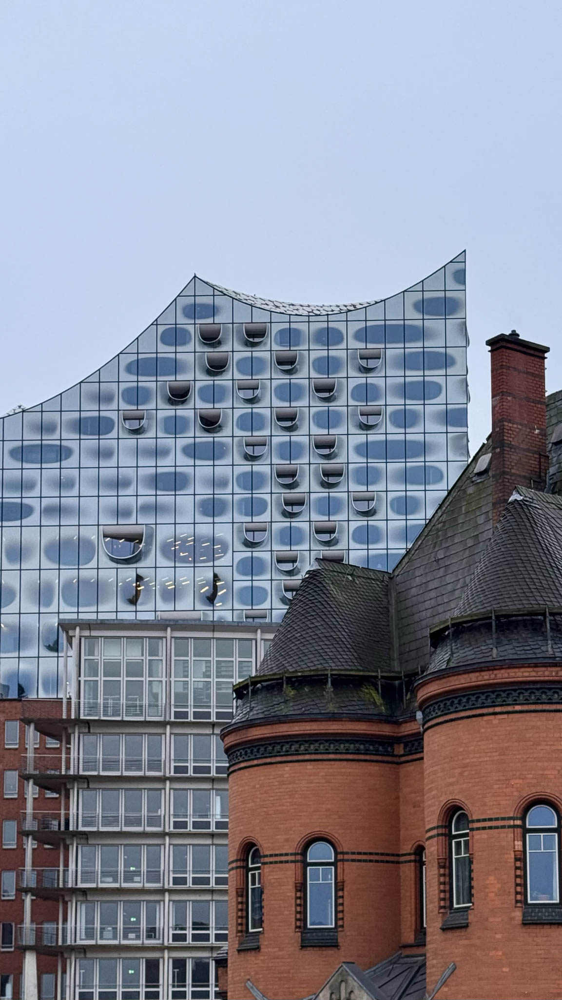
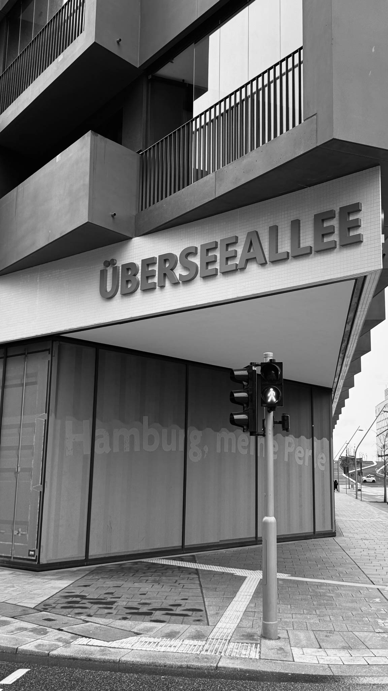
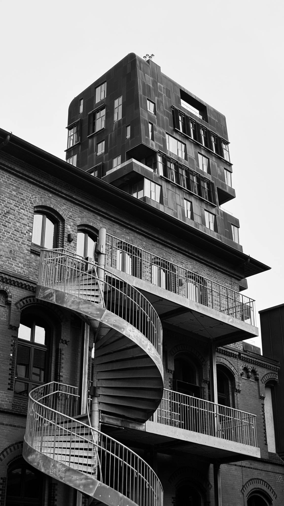
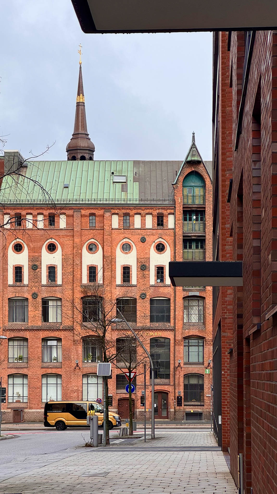
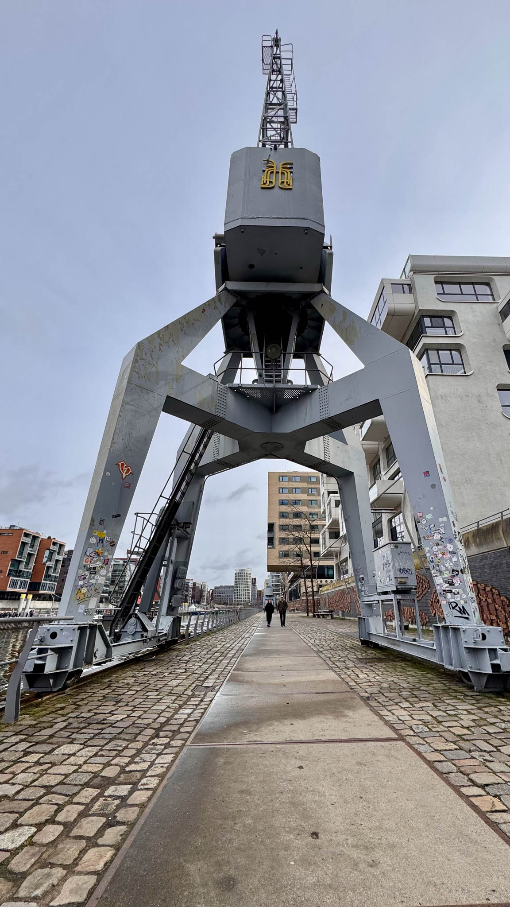
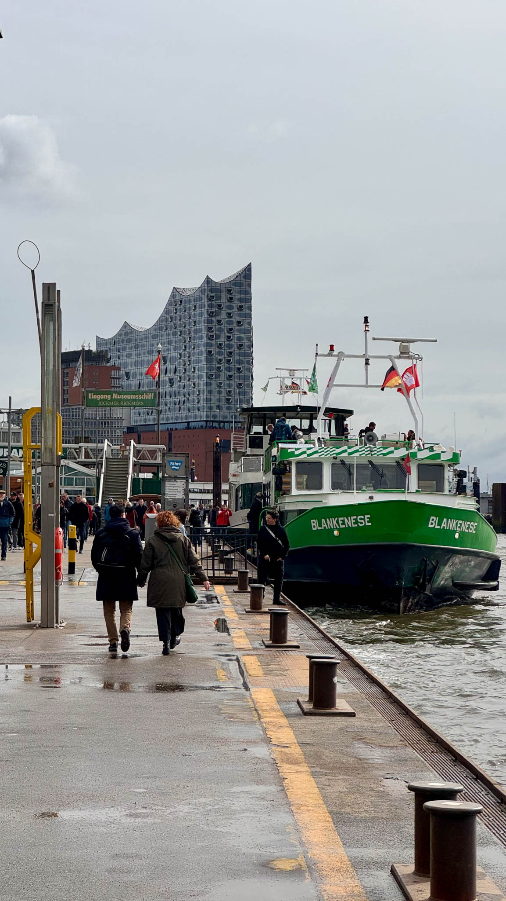

I love the historic-maritime charm of the old Hanseatic city of Hamburg — both its slightly shabby and its modernist, cosmopolitan vibe. Recently, I got to spend another weekend there and explored a bit.

Pictures taken with the Apple iPhone 15 Pro.