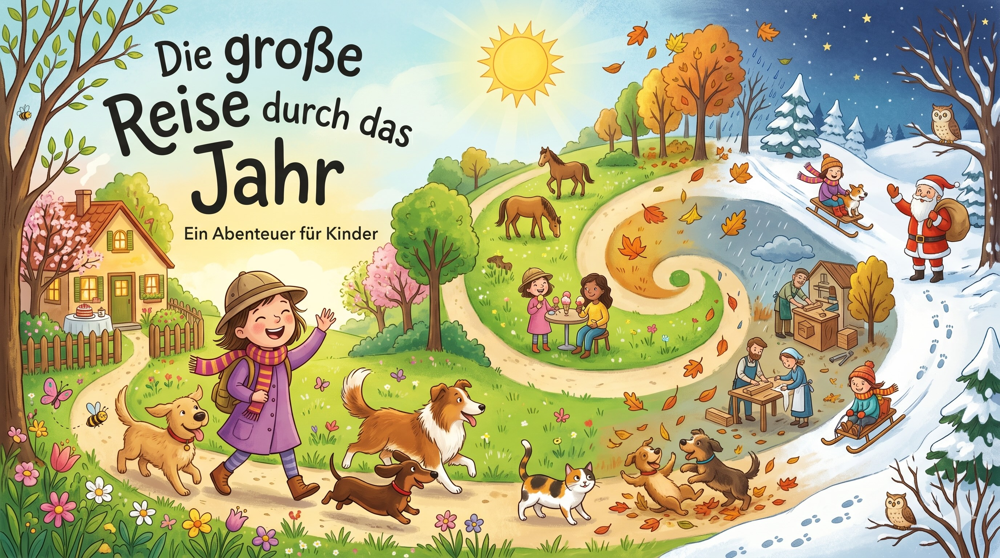

Künstliche Intelligenz verspricht hohe Zugewinne an Produktivität im Beruf, kann Bilder und Videos zu jedem erdenklichen Thema erzeugen und besonders bei der Verarbeitung von Text spielen aktuelle KI-Technologien ihre Stärken aus.  
  
Aber wie gut ist KI wirklich beim gezielten Erzeugen von Texten? Das habe ich in einem Praxistest mit einer Expertin versucht herauszufinden.  
  
## Die Mitstreiter  
  
Im Vergleich ließ ich Google Gemini und Le Chat (mittlerweile: Vibe) von Mistral, die bekannteste europäische Alternative zu den amerikanischen und chinesischen Lösungen, gegeneinander antreten.  
Der Test fand Anfang Mai statt, wobei beide Werkzeuge in den „Thinking-Modus“ bzw. „Denken“ gestellt waren, und damit nicht die schnellste, sondern „überlegtere“ Antworten ausgeben sollten.  
  
## Die Versuchsidee  
  
Hintergrund: Zum Zweck des Schreibenübens erhält ein achtjähriges Mädchen in der Schule jede Woche 5-8 Lernwörter, die es mehrmals lesen und schreiben soll. Jede Woche gibt es dazu eine Lernzielkontrolle.  
Idee: Wäre es nicht schön, wenn man diese Wörter nicht nur als Liste, sondern als Text lesen und erfassen könnte? Genau das soll die KI übernehmen.  
  
Kernelement des Versuchs ist somit die Generierung eines zusammenhängenden Textes, wobei der Text viele der vorgegebenen Lernwörter (Nomen, Verben, Adjektive) enthalten soll.  
  
  
*Dieses Bild wurde mithilfe von Google Gemini erstellt*  
  
## Der Prozess  
  
- Beide KI-Werkzeuge erhielten die gleiche Eingabe (Prompt). Dieser Prompt wurde nicht KI-optimiert, siehe auch Abschnitt Optimierungsmöglichkeiten.  
  
> das sind die lieblingswörter eines achtjährigen mädchens.  
> 
> erstelle einen text, der ca. 80% der wörter enthält. die geschichte soll inhaltlich sinnvoll und zusammenhängend sein, und im stil einer abenteuergeschichte geschrieben sein.  
> 
> sei kreativ, aber berücksichtige das alter von 8 jahren.  
> 
> _______________  
> 
> Das, der, Hunde, drei, Heft, Haus, holen, Hut, sehen, Teller, ein, eine, teilen, Leiter, Eis, ist, wir, ich, malen, rufen, und, hat, Schal, schlafen, Tisch, sind, Schuhe, Katze, zwei, die, Kinder, Zaun, Kiste, kaufen, Kleid, kann, Puppe, Opa, hat, putzen, Ampel, Jause, jeder, jagen, ja, seine, Garten, Regen, gehen, Glas, Zug, Dach, Koch, suchen, hoch, machen, heute, Eule, Feuer, Euro, Huhn, Würfel, Nüsse, wünschen, mir, grün, hören, Löffel, Löwe, laut, Frösche, Buch, Blume, Brille, blau, habe, Äpfel, Äste, Bäume, ärgern, zählen, Steine, Sterne, Spinne, Spitzer, mein, Biene, spielen, Wiese, liegen, Qualle, Pferde, Apfel, stehen, groß, Fuß, die Blätter, der Herbst, der Nebel, der Regen, der Wind, bunt, kalt; der Mann, der Sack, bringen, warten, ihn, schon, Nikolaus, Weihnachten, die Wünsche, der Wunsch, der Stern, wünschen, für, sein, das Bett, der Tisch, der Sessel, das Dach, das Fenster, das Haus, das Zimmer, Montag, Dienstag, Mittwoch, Donnerstag, Freitag, Samstag, Sonntag, das Jahr, Jänner, Februar, März, April, Mai, Juni, der Monat, Juli, August, September, Oktober, November, Dezember, die Rodel, der Schi, der Stein, der Winter, eislaufen, stürzen, Schnee, sitzen, trinken, gehen, essen, laufen, fahren, springen, schwarz, rot, blau, gelb, braun, lila, rosa, das Auge, die Füße, der Kopf, die Nase, das Ohr, die Zähne, waschen, das Brot, das Fleisch, die Milch, der Salat, die Suppe, die Torte, frisch, der Arzt, das Fieber, die Frau, der Husten, der Schnupfen, die Woche, krank, der Brief, der Herr, die Karte, das Paket, die Post, der Sohn, senden, das Ei, das Gras, das Nest, Ostern, verstecken, suchen, finden, der Berg, die Biene, die Blume, der Frühling, blühen, gehen, stehen, die Ampel, die Straße, der Verkehr, die Hupe, laut, groß, jetzt, der Arbeiter, der Lehrer, arbeiten, schneiden, die Schneiderin, der Tischler, die Bäuerin, die Ecke, die Eltern, das Glück, das Stück, decken, wecken, früh  
  
- Bei Mistral musste ich nochmals nachhaken, um statt 32,73% der Wörter 62,27% der Wörter im Text eingebaut zu haben, während Gemini beim ersten Mal rund 90% der Wörter verwendete (alles eigene Angaben auf Nachfrage, nicht nachgezählt).  
- Um die Evaluierung nicht durch optische Eindrücke zu verfälschen, habe ich bei Mistral das Ergebnis durch weitere Prompts noch weiter verfeinert, um die selbe Struktur wie bei Gemini zu erreichen.  
- Während Gemini automatisch ein formatiertes PDF ausgab, machte ich bei Mistral die PDF-Erstellung über ein Textverarbeitungsprogramm, in das ich das Ergebnis 1:1 kopiert habe.  
- Expertenevaluierung: Die über alle Zweifel erhabene Evaluierung ist das Urteil des achtjährigen Mädchens - genau für die Achtjährige wurde der Text schließlich generiert, genau dieses Ziel wurde im Prompt definiert.  
- Die Schülerin bekam beide Geschichten in schwarz-weiß ausgedruckter Form vorgelegt, las sie und bestimmte dann ihren Favoriten.  
  
Hier sind die Ergebnisse von [Google Gemini](../images/general/20260530/ki_praxistest_geschichte_gemini.pdf) und [Le Chat von Mistral](../images/general/20260530/ki_praxistest_geschichte_mistral.pdf).  
  
## Der Sieger  
  
Als entscheidendes Kriterium gilt im Prozess, welche der beiden Abenteuergeschichten der achtjährigen Schülerin am besten gefällt. 
Ihr Urteil war sehr klar - die schönere, weil spannendere Geschichte, hat Mistral geschrieben.  
  
Die Texte ließen die Schülerin mit ein paar Fragezeichen und teilweiser Verwirrung zurück - weiteres dazu siehe im letzen Abschnitt.  
  
  
## Die Optimierungsmöglichkeiten  
  
Die Ergebnisse mit einer einfachen Eingabe waren bereits recht gut.

Wie könnte man die Textgenerierung noch optimieren?  
  
- **Besseres Modell verwenden:** Im Versuch wurden zwei KI-Lösungen verwendet, die als Universalwerkzeug für Ottonormalverbraucher ausgelegt sind. Es ist anzunehmen, dass durch Nutzung von spezialisierten Modellen bzw. auch anderer Konfiguration (Modell länger nachdenken lassen usw.) bessere Ergebnisse entstehen würden, aber auch die Kosten höher wären.  
- **Prompt verbessern:** Ein hilfreicher Trick bei der Nutzung von derartigen KI-Werkzeugen ist es, die KI auch bereits zum Schreiben der Eingabe zu nutzen - also das Ergebnis in mehreren Schritten zu erstellen. Dadurch lässt sich die Eingabe für die „Denkweise“ der KI schon voroptimieren und das Ergebnis oftmals noch weiter verbessern.  
  
  
## Was lernen wir daraus?  
  
In dem Versuch ging es mir in Wirklichkeit natürlich nicht darum, eine schöne Geschichte zu generieren, sondern um zwei Punkte:  
  
### Technische Möglichkeiten ausprobieren  
Mich interessierte es, wie gut aktuelle, breit verfügbare KI-Modelle mit dieser Art von Aufgabe umgehen können, und wie sie sich im Ergebnis und Weg dorthin unterscheiden.  
  
Natürlich kratzt dieser Versuch nur ganz zart an den Möglichkeiten moderner KI-Systeme. Aber auch so fand es bemerkenswert, wie wenig Aufwand nötig ist, um für ein relativ spezielles Problem so brauchbare Ergebnisse zu bekommen.   
Denkt man die Entwicklungsgeschwindigkeit ein paar Jahre in die Zukunft, wird die KI noch viel weitreichendere Möglichkeiten eröffnen. Diesen sollten wir Menschen offen gegenüber stehen und sie uns zu Nutze machen, ohne auf die Risiken und Gefahren zu vergessen.   
  
### Kritische Nutzung und Medienkompetenz  
Am wichtigsten in diesem Versuch war es mir, anhand dieses gemeinsamen Experiments das Thema KI mit der Achtjährigen zu diskutieren. Sie wusste zuvor nicht, wie es zu diesen Texten kam. Beim Lesen erkannte sie aber gleich ihre Lernwörter und es kam ihr schon manches eigenartig vor („Zähne waschen“, „ein Apfel, Äpfel, …“,  ).


Ganz generell ist sie spitze mit der Situation umgegangen - interessiert und offen gegenüber dem was da kam, gleichzeitig kritisch und hinterfragend.

Wir haben am Experiment erkannt, dass eines wichtig ist: Wenn man etwas Unbekanntes sieht und liest - stets neugierig sein, aber auch immer etwas misstrauisch sein und hinterfragen. Dies ist eine der zentralen Kompetenzen im digitalen und KI-Zeitalter, auch für Erwachsene.  
  
## Gedanken zum Schluss
  
Nachdem wir im Anschluss die Generierung des Textes nochmals gemeinsam durchgeführt haben, weiß die achtjährige Schülerin auch, wie das Erstellen solcher Texte funktioniert. 

Vielleicht hat sie dazu in Zukunft selbst Ideen - es wäre super, sie mit Neugierde und   einem bewussten Maß an Skepsis gemeinsam auszuprobieren.