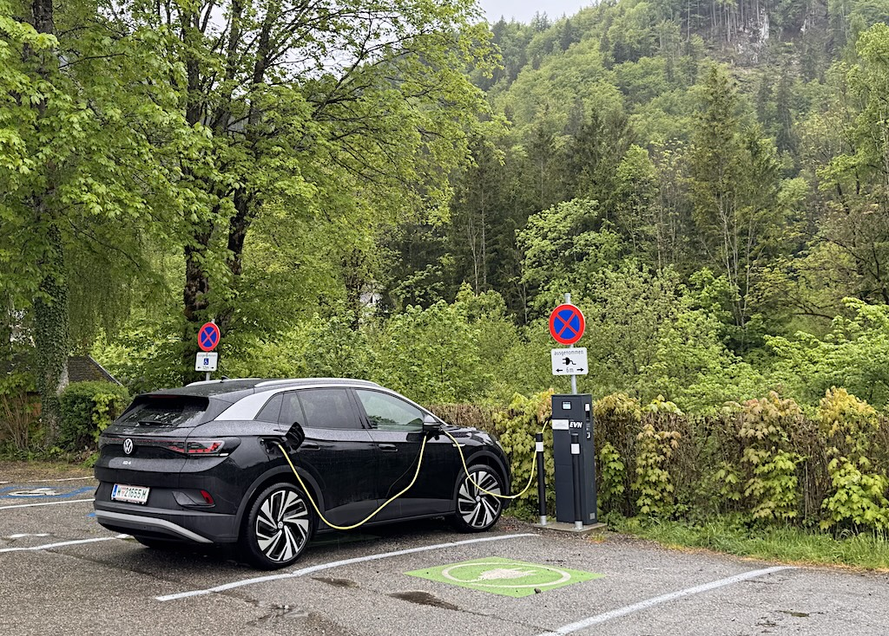

Teils zu Recht wird oftmals angemerkt, dass Elektroautos nicht so grün sind wie behauptet, da die Batterieherstellung den Gesamt-CO2-Ausstoß nach oben treibt.
Außerdem ist der Strom ja nicht so grün wie immer behauptet wird.

 

Was stimmt denn nun?
Ich habe mir das auf Basis von verfügbaren Daten einmal angeschaut:

  
|  g CO2/kWh  |  Bezeichnung  |  Quelle  |
| --- | --- | --- |
|  11 g  | CO2-Intensität von Laufwasserkraftwerken  | [Link](https://www.electricitymaps.com/data/methodology) |
|  13 g  | CO2 Intensität von Windkraft  | [Link](https://www.electricitymaps.com/data/methodology) |
|  20 g  | CO2-Intensität im Strommix Südschweden SE-SE3, 18.7.2026 mittags; sowie Gesamtjahr 2025  | [Link](https://app.electricitymaps.com/map/zone/SE-SE3/all/yearly) |
|  31 g  | CO2-Intensität von Photovoltaik  | [Link](https://www.electricitymaps.com/data/methodology)   |
|  70 g  | CO2-Intensität im Strommix Österreich AT, 18.7.2026 mittags  | [Link](https://app.electricitymaps.com/map/zone/AT/live/fifteen_minutes) |
|  164 g  | Durchschnittliche CO2-Intensität im Strommix Österreich AT, Gesamtjahr 2025  | [Link](https://app.electricitymaps.com/map/zone/AT/all/yearly) |
|  342 g  | Durchschnittliche CO2-Intensität im Strommix Deutschland DE, Gesamtjahr 2025  | [Link](https://app.electricitymaps.com/map/zone/DE/all/yearly)  |
|  450 g  | Geringste technisch erreichbare CO2-Intensität der effizientesten fossilen Kraftwerke (GuD Gaskraftwerk)  | [Link](https://de.wikipedia.org/wiki/Gas-und-Dampf-Kombikraftwerk)  |
|  566 g  | Durchschnittliche CO2-Intensität im Strommix Polen PL, Gesamtjahr 2025  | [Link](https://app.electricitymaps.com/map/zone/PL/all/yearly)   |
|  700 g  | CO2-Intensität, die Elektrizität haben müsste, um beim Elektroauto den gleichen CO2-Ausstoß zu verursachen wie ein Benzinfahrzeug; bezogen auf den Verbrauch im Betrieb (bei 20 kWh/100km bzw. 6l/100km)  | [Link](https://chat.mistral.ai/chat/c816b90e-91e4-4f45-a7d3-f8cd39a5e8ee) |
|  906 g  | CO2-Intensität von Kohlekraftwerken | [Link](https://www.electricitymaps.com/data/methodology) |
  
  
Meine Erkenntnisse dazu:  

- Selbst wenn der Strom zum Laden des Elektroautos aus Gas in einem modernen GuD-Kraftwerk produziert werden würde, wäre das Elektroauto im Betrieb noch immer wesentlich CO2-ärmer als ein benzinbetriebenes (450 g vs. 700 g).
- Auch im Kohlestromland Polen - das größte dortige Kohlekraftwerk stößt mehr CO2 aus als ganze Staaten - wäre ein Elektroauto im Betrieb CO2-ärmer als ein Benziner.
- Ein häufiger Kritikpunkt bei Elektroautos ist der CO2-„Rucksack“ der Batterieherstellung. Schauen wir uns das an: Für die Herstellung von Lithium-Akkus fallen lt. [Nature-Paper aus 2024](https://www.nature.com/articles/s41467-024-54634-y) etwa 60-75 kg CO2/kWh an. Daraus und mit oben genannten Werten lässt sich auch auf die CO2-Intensität des Gesamtfahrzeug inkl. Produktion schließen und damit ausrechnen, ab welcher Laufleistung ein Elektroauto insgesamt CO2-effizienter als ein Benziner ist. Für ein typisches Auto sind das ca. 35.000 km im österreichischen Strommix. Ab diesem Punkt hat das Elektroauto den „Rucksack“ abgebaut und trägt positiv zur Gesamtklimabilanz des Verkehrs bei.