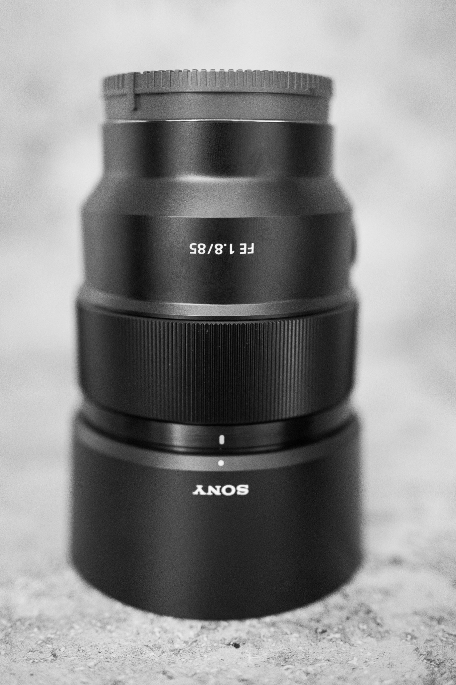

After writing about the [Sony FE 1.8/35mm](../sony_sel35f18f_review) and the [Sony FE 4-5.6/28-60mm ](../sony_sel2860_review), I want to conclude the review series of the lenses I use (as of 2022) with the Sony A7C with this review of the Sony FE 1.8/85mm.
How to read it: [As written before](../leanest_highest_quality_casual_photography_setup/), I am valueing a lean and high-quality setup, spporting a __casual__ photography style. 

The Sony FE 1.8/85mm is a great choice for this as part of the mentioned setup with the Sony A7C full-frame camera.

## Plus and minus

What I like:
- Autofocus: the AF is very fast, silent and accurate, it can keep up with tracking the moves of a toddler with ease.
- Build quality: the look and feel is very solid for its class, Sony also promises basic water-resistance.
- Sharpness: The lens is very sharp, starting at F1.8 and even improving with stopping down to f2.8. 

What I do not like:
- Minimum focus distance: with a minimum focus distance of 0,8m you often reach the proximity limit. (For [close ups](../spring_blossoms/) I use simple extension tubes - these make the lens a nice and cost-effective macro option.)
- Vignetting: the edges of the frame are notably darker at F1.8, which is however easily controllable with automated lens corrections in Lightroom.
- CA: you'll find some  purple fringes at high-contrast edges when using this lense at fast apertures.

## My conclusion

....
To use the benefits of full-frame for family and .., you need a fast portrait lens as the Sony FE 1.8/85mm.
Not this one, concerning sharpness at all apertures this lens scores 10/10 for me.

Overall, ...

## Samples

How the Sony FE 1.8/85mm performs on the Sony A7C you will see on the images below. As always, I applied my normal processing using Adobe Lightroom and developed the RAWs according to my taste.
Click to access the full-sized image.

