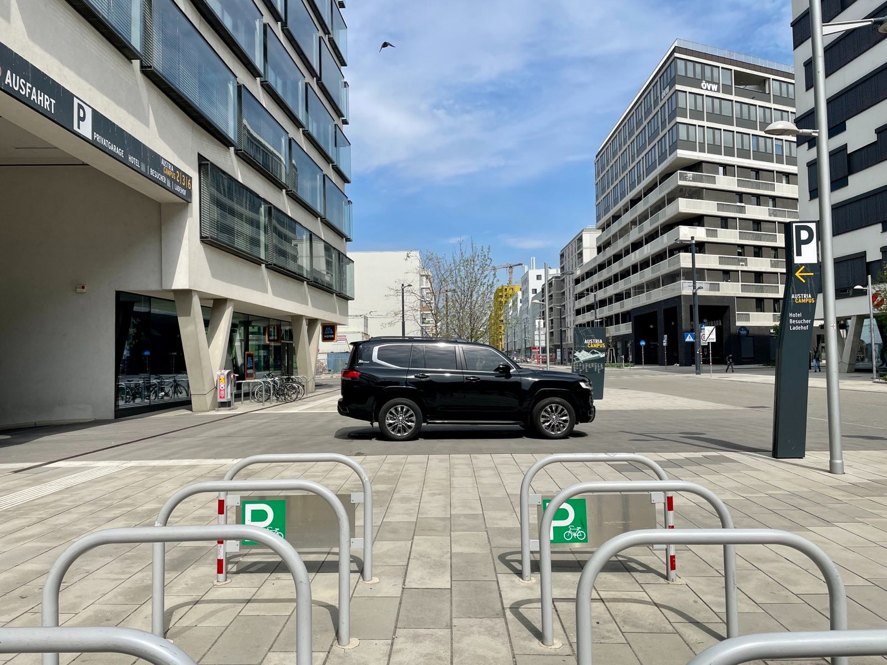

Das abgewandelte Zitat von Henry Ford im Titel beschreibt die Situation am (österreichischen) Elektroautomarkt.

Foto: Ein Stadtgeländewagen in seinem natürlichen Habitat (beliebiges Beispielfoto) 

Um eines vorweg zu klären: Man kann den Sinn eines eigenen PKW in der Stadt generell in Frage stellen. Wir haben für uns für den Luxus eines eigenen Autos zugunsten von umfangreicheren Freizeitgestaltungsmöglichkeiten entschieden.

Klar war für uns dabei ein Elektroauto anzuschaffen, da dieses im Vergleich zum Verbrenner [belegterweise weniger schlecht](https://faktencheck-energiewende.at/fakt/ist-ein-elektroauto-wirklich-besser-fuer-die-umwelt/) ist.

Ein weiterer Wunsch unsererseits war schwieriger umzusetzen. Wir wollten wieder einen (raum-)effizienter Familienkombi, wie wir ihn vorher mit Verbrennungsmotor hatten. Leider wurde uns schnell klar, dass so etwas am Elektroautomarkt nicht existiert.
Im Wesentlichen gibt es Kleinwagen, Limousinen oder eben eines der vielen E-SUVs von allen möglichen Herstellern.
Da wir gewisse Anforderungen bei der Größe für vier Personen haben, blieben dann nicht mehr viele Fahrzeuge übrig.

1. Eine Elektro-Limousine eines deutschen Herstellers, die zwar ein Platzkompromiss, aber sehr sparsam gewesen wäre. Manko: Lieferzeit von gut 12 Monaten - leider ein K.O.-Kriterium¹.
2. Ein E-SUV eines anderen Herstellers, das zumindest nicht ganz so protzig wie andere Stadtgeländewagen daherkommt: geräumig auch für vier Personen und prompt verfügbar.
3. Alle anderen in Frage kommenden Fahrzeuge waren entweder auch E-SUVs oder es gab einen wesentlichen praktischen Ausschlussgrund.

Am Ende wurde es ... das E-SUV (2.).

Das Fahrzeug an sich ist toll. Sicher, geräumig, spielt viele Stückerl die dem Komfort zuträglich sind, lädt schnell, hat eine sinnvolle Batteriegröße und ist auch sonst ein ausgereiftes Produkt. Es wäre halt meiner Meinung nach viel gescheiter, es als eleganteren und effizienteren Kombi zu bauen. Man bekäme durch geringeren Luftwiderstand bei gleicher Batterie größere auch noch mehr Reichweite "geschenkt".

Wenn mir die Autoindustrie kommt mit: "Die Kunden wollen eben SUVs, nur deshalb bauen wir sie", kann ich nur müde lächeln. Die Nachfrage der Kunden für vernünftige, effiziente und hochqualitative Kombis vom Schnitte eines BMW 3er Touring, Skoda Octavia, ... wäre da. Ihre eigenen gezielten SUV-Marketingkampagnen seit Jahren und die erzielten Margen der Stadtgeländewagen sind die Gründe, weshalb die Automobilhersteller diese Autos priorisieren.

¹Ein E-SUV der gleichen Preisklasse des gleichen Herstellers wäre binnen Wochen verfügbar gewesen. Man sieht also deutlich, welche Prioritäten Automobilhersteller setzen.
